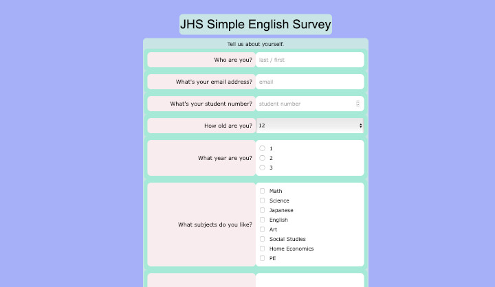

# [Simple Survey]()
A simple survey form.

## Purpose/Goal
To learn the basics of making an HTML form.

## Operation
This is just a structural page. The submit button doesn't submit anything.

## Tech/Libraries Used
* HTML
* CSS
* JavaScript

## Problems/Solutions
N/A

## More Information
See the upgraded version [here]()
